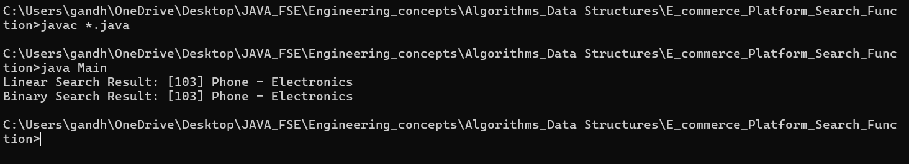

# 📦 E-commerce Platform Search Function

## 🧠 Objective

This exercise focuses on implementing and analyzing different search algorithms within an e-commerce platform. You will explore how algorithm efficiency impacts performance, especially with growing data.

---

## ✅ Problem Statement

In an e-commerce platform, users need to search for products quickly and efficiently. This project demonstrates how **linear search** and **binary search** work, and compares their performance for such use cases.

---

## 🧮 Step-by-Step Breakdown

### 1. Understand Asymptotic Notation

- **Big O Notation**: Describes the upper bound of an algorithm’s runtime as input size increases.
  - Helps in predicting scalability and efficiency.
  - Example: `O(n)` means time grows linearly with input size.

- **Best, Average, and Worst-Case Scenarios**:
  - **Best case**: Item found at the beginning (O(1)).
  - **Average case**: Item is somewhere in the middle (O(n/2) → O(n)).
  - **Worst case**: Item not found or found at the end (O(n) for linear, O(log n) for binary).

---

### 2. Setup

- A `Product` class is created with:
  - `productId`
  - `productName`
  - `category`
- These attributes are used as the basis for search operations.

---

### 3. Implementation

- **Linear Search**:
  - Iterate through the array of products.
  - Compare the target attribute with each product.

- **Binary Search**:
  - Sort the array of products (based on product name or ID).
  - Use divide-and-conquer to find the target element.

---

### 4. Analysis

| Search Type     | Time Complexity | Suitable For               |
|----------------|------------------|-----------------------------|
| Linear Search   | O(n)             | Unsorted or small datasets  |
| Binary Search   | O(log n)         | Large, sorted datasets      |

- **Conclusion**:
  - Binary Search is faster but requires sorted data.
  - Linear Search is flexible but slower with larger data.

---

## 📌 Folder Structure

week_1/  
└── Algorithms_Data_Structures/  
└── E_commerce_Platform_Search_Function/  
├── Main.java  
├── Product.java  
├── SearchUtils.java  
├── output.png  

---
##  Output

🖼️ 
---
## 🚀 Outcome

By completing this exercise, learners gain:

- Understanding of search algorithms
- Experience with time complexity analysis
- Knowledge of when and why to choose a particular algorithm in real-world applications
