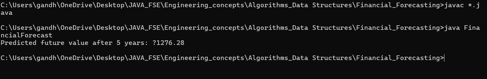

# 📈 Financial Forecasting Tool

## 🧠 Objective

To build a financial forecasting tool that predicts future values using a recursive approach based on historical growth data.

---

## 📊 Problem Statement

The tool must estimate future values based on the historical growth rate using recursion. This demonstrates how recursive thinking can be applied to real-world financial problems and how such algorithms can be optimized for performance.

---

## 🧮 Step-by-Step Breakdown

### 1. Understand Recursive Algorithms

- **Recursion**: A method where a function calls itself to solve smaller instances of the same problem.
- **Base Case**: Stops the recursion when a certain condition is met.
- **Recursive Case**: Continues breaking down the problem.
  
> Recursion can simplify problems like computing future values by modeling the growth over time in a repeatable pattern.

---

### 2. Setup

- Create a method to **calculate future financial value** based on:
  - Initial amount
  - Growth rate (percentage)
  - Number of periods (years)

---

### 3. Implementation

- Use a **recursive function** to apply the formula:
  
  \[
  \text{FutureValue}(n) = \text{FutureValue}(n-1) \times (1 + \text{growthRate})
  \]

- Example inputs:
  - Initial Value = 1000
  - Growth Rate = 10% (0.10)
  - Periods = 5 years

---

### 4. Analysis

#### 🕒 Time Complexity:

- **Recursive Version**: O(n), since it makes `n` recursive calls.
- **Optimized Version** (using memoization): Can avoid redundant recalculations in certain variations.

#### ⚙ Optimization Tips:

- **Use memoization** to cache intermediate results.
- **Convert to iterative** if recursion depth becomes too large.
- **Tail recursion** (if supported by language optimization) can improve performance.

---

## 📂 Folder Structure

week_1/  
└── Algorithms_Data_Structures/  
└── Financial_Forecasting/  
├── FinancialForecast.java  
├── FinancialForecast.class  
├── output.png  

---

🖼️ 

---

## 🚀 Outcome

By completing this task, you will:

- Understand and apply recursive logic to real-world problems
- Learn to analyze and optimize recursive solutions
- Explore how financial data can be modeled programmatically
