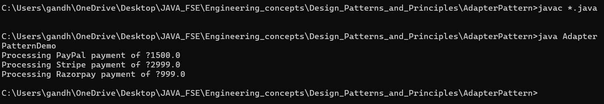

# 🔌 AdapterPatternExample

## 💼 Exercise 4: Implementing the Adapter Pattern

---

### 📘 Scenario

You are developing a **payment processing system** that needs to integrate with **multiple third-party payment gateways**, each with different interfaces. To standardize interaction, the **Adapter Design Pattern** is used.

---

### ✅ Implementation Steps

1. **Created Java Project**
   - Project name: `AdapterPatternExample`

2. **Defined a Target Interface**
   - `PaymentProcessor.java` with method like `processPayment(amount)`.

3. **Created Adaptee Classes (Third-Party Gateways)**
   - `PayPalGateway.java`
   - `StripeGateway.java`
   - `RazorpayGateway.java`
   - Each of these has its own unique method names and logic.

4. **Created Adapter Classes**
   - `PayPalAdapter.java`
   - `StripeAdapter.java`
   - `RazorpayAdapter.java`
   - These adapters **implement `PaymentProcessor`** and internally call respective gateway methods.

5. **Tested the Pattern**
   - `AdapterPatternDemo.java` demonstrates using all payment gateways **via a common interface** (`PaymentProcessor`).

---

### 📁 Project Structure

AdapterPattern/
├── AdapterPatternDemo.java  
├── AdapterPatternDemo.class  
├── PaymentProcessor.java  
├── PaymentProcessor.class  
│  
├── PayPalGateway.java  
├── PayPalGateway.class  
├── PayPalAdapter.java  
├── PayPalAdapter.class  
│  
├── StripeGateway.java  
├── StripeGateway.class  
├── StripeAdapter.java  
├── StripeAdapter.class  
│  
├── RazorpayGateway.java  
├── RazorpayGateway.class  
├── RazorpayAdapter.java  
├── RazorpayAdapter.class  
│  
├── output.png  
└── README.md  

🖼️ 

---

### 🧠 Pattern Insight

- **Adapter Pattern** allows incompatible interfaces to work together.
- Helps in **plugging in third-party systems** without changing your core logic.
- Promotes **flexibility** and **reusability**.

---

### ▶️ How to Run

1. Compile:
   ```bash
   javac *.java
2. Run:
   ```bash
   java AdapterPatternDemo


