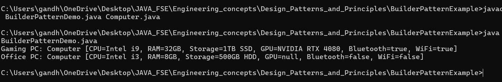

# 🧱 BuilderPatternExample

## 💼 Exercise 3: Implementing the Builder Pattern

---

### 📘 Scenario

You are developing a system to create complex objects like a **Computer** with multiple optional parts. The **Builder Design Pattern** helps manage this construction process step-by-step, offering flexibility and clean object creation.

---

### ✅ Implementation Steps

1. **Created Java Project**
   - Project Name: `BuilderPatternExample`

2. **Defined a Product Class**
   - `Computer.java` contains attributes like CPU, RAM, Storage, etc.

3. **Implemented the Builder Class**
   - A **static nested `Builder` class** inside `Computer` allows step-by-step configuration.
   - Builder includes methods like `setCPU()`, `setRAM()`, etc., and a `build()` method.

4. **Private Constructor in Product**
   - The main `Computer` class has a private constructor accepting a `Builder` object.

5. **Tested the Pattern**
   - `BuilderPatternDemo.java` demonstrates multiple computer configurations using the Builder pattern.

---

### 📁 Project Structure

BuilderPatternExample/  
├── BuilderPatternDemo.java  
├── BuilderPatternDemo.class  
├── Computer.java  
├── Computer.class  
├── Computer$Builder.class  
├── image.png  
├── output.png  
└── README.md  


🖼️ 

---

### 🧠 Pattern Insight

- **Builder Pattern** is ideal for creating complex objects with many optional parameters.
- Ensures immutability and cleaner object construction compared to telescoping constructors.

---

### ▶️ How to Run

1. Compile:
   ```bash
   javac *.java
2. Run:
   ```bash
   java BuilderPatternDemo

