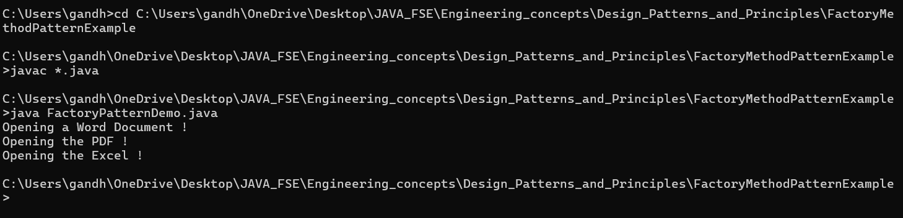

# 📄 FactoryMethodPatternExample

## 🎯 Exercise 2: Implementing the Factory Method Pattern

---

### 🧩 Scenario

You are developing a **Document Management System** that needs to create different types of documents (e.g., **Word**, **PDF**, **Excel**) dynamically. To keep the code **extensible** and **decoupled**, you apply the **Factory Method Design Pattern**.

---

### 🏗️ Implementation Steps

1. **Created a New Java Project**
   - Project name: `FactoryMethodPatternExample`

2. **Defined an Abstract Document Class**
   - `Document.java` defines a common interface or abstract class for all document types.

3. **Created Concrete Document Types**
   - `WordDocument.java`
   - `PdfDocument.java`
   - `ExcelDocument.java`

4. **Implemented the Factory Method Pattern**
   - Abstract Factory: `DocumentFactory.java` (declares `createDocument()`)
   - Concrete Factories:
     - `WordDocumentFactory.java`
     - `PdfDocumentFactory.java`
     - `ExcelDocumentFactory.java`

5. **Tested the Pattern**
   - `FactoryPatternDemo.java` serves as the main/test class to create documents using different factories.

---

### 📁 Project Structure

FactoryMethodPatternExample/  
  ├── Document.java / Document.class  
  ├── WordDocument.java / WordDocument.class  
  ├── PdfDocument.java / PdfDocument.class  
  ├── ExcelDocument.java / ExcelDocument.class  
  ├── DocumentFactory.java / DocumentFactory.class  
  ├── WordDocumentFactory.java / WordDocumentFactory.class  
  ├── PdfDocumentFactory.java / PdfDocumentFactory.class  
  ├── ExcelDocumentFactory.java / ExcelDocumentFactory.class  
  ├── FactoryPatternDemo.java / FactoryPatternDemo.class  
  ├── output.png  
  └── README.md  


🖼️ 

---

### 🔍 Design Pattern Summary

- **Factory Method Pattern** provides an interface for creating objects but allows subclasses to alter the type of objects that will be created.
- Promotes **loose coupling** and **code scalability**.

---

### ▶️ How to Run

1. Compile all `.java` files:
   ```bash
   javac *.java
2. To Run :
   ```bash
   java FactoryPatternDemo

