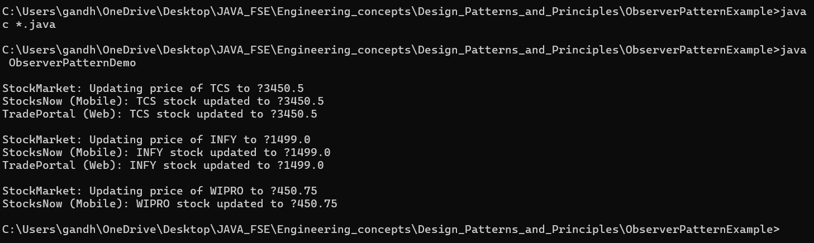

# FactoryMethodPatternExample

## 🧑‍🏭🏭 Exercise 2: Implementing the Factory Method Pattern

### 📘 Scenario

You are building a **Document Management System** that must support the creation of various document types—Word, PDF, and Excel—without tightly coupling the client code to specific document classes. This project applies the **Factory Method Design Pattern** to accomplish this.

---

### 🧱 Project Structure

FactoryMethodPatternExample/
├── Document.java # Abstract base/interface for all document types
├── WordDocument.java # Concrete Word document class
├── PdfDocument.java # Concrete PDF document class
├── ExcelDocument.java # Concrete Excel document class
│
├── DocumentFactory.java # Abstract factory class
├── WordDocumentFactory.java # Factory for creating Word documents
├── PdfDocumentFactory.java # Factory for creating PDF documents
├── ExcelDocumentFactory.java # Factory for creating Excel documents
│
├── FactoryPatternDemo.java # Main class for testing the factory pattern
├── output.png # Screenshot of the program output
└── README.md


---

### ✅ Implementation Summary

1. **Abstract Document Class / Interface**
   - `Document.java` defines a generic document interface or abstract class.

2. **Concrete Document Classes**
   - `WordDocument`, `PdfDocument`, and `ExcelDocument` implement the `Document` abstraction.

3. **Abstract Factory**
   - `DocumentFactory.java` declares the abstract method `createDocument()`.

4. **Concrete Factories**
   - `WordDocumentFactory`, `PdfDocumentFactory`, and `ExcelDocumentFactory` implement `createDocument()` to return respective document types.

5. **Test Class**
   - `FactoryPatternDemo.java` creates and manages documents using their respective factories without knowing the internal implementation.

---

🖼️ 

---

### 🔍 Concepts Demonstrated

- Factory Method Design Pattern
- Encapsulation and Abstraction
- Code Reusability and Maintainability
- Decoupling object creation from implementation

---

### ▶️ How to Run

1. Clone or download the repository.
2. Compile the project:
   ```bash
   javac *.java
3. Run the project:
   ```bash
   java FactoryPatternDem
