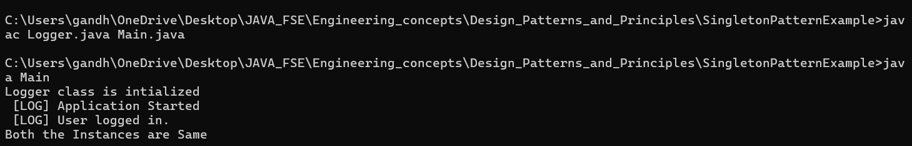

# SingletonPatternExample

## 🧩 Exercise 1: Implementing the Singleton Pattern

### 📘 Scenario
This Java project demonstrates the **Singleton Design Pattern** through a custom `Logger` utility. The purpose is to ensure that only **one instance of the `Logger` class** exists and is shared throughout the application lifecycle.

---

### 📁 Project Structure

SingletonPatternExample/
├── Logger.java # Singleton class definition
├── Main.java # Test class to verify Singleton behavior
├── Logger.class # Compiled Singleton class
├── Main.class # Compiled test class
├── output.png # Screenshot of sample output
├── Screenshot 2025... # Additional screenshot from demo
└── README.md # Project documentation

---

### ✅ What’s Implemented

1. **Singleton Class – `Logger.java`**
   - Uses a private static instance to ensure only one object is created.
   - Constructor is made `private`.
   - `getInstance()` method returns the single instance.

2. **Test Class – `Main.java`**
   - Demonstrates reuse of the same logger instance.
   - Validates that multiple `getInstance()` calls return the same reference.

3. **Output Proof**
   - Screenshots included (`output.png`, etc.) to visually confirm singleton behavior.

---

### 🧠 Concepts Demonstrated

- Singleton Design Pattern (Lazy Initialization / Eager if used)
- Static instance control
- Logging simulation
- Java class structure and compilation

---

### ▶️ How to Run

1. Open the project in your Java IDE or terminal.
2. Compile:  
   `javac Logger.java Main.java`
3. Run:  
   `java Main`
4. Observe the output confirming only one `Logger` instance is used.

---

### 📸 Screenshots

| Output Snapshot |
|-----------------|
|  |

---

### 👨‍💻 Author

**Gandham Lokesh**  
_MERN Stack Developer & Java Enthusiast_

---
