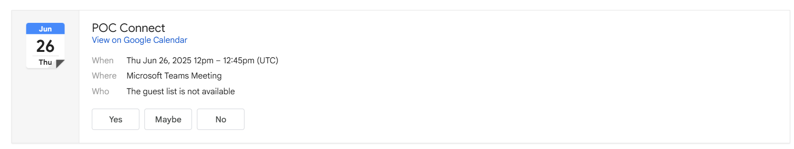
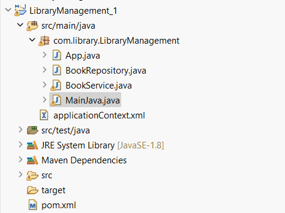

  # Spring Core Maven Project
  
  This project demonstrates the basics of using Spring Core with Maven as the build tool. It is part of the Week 3 assignment for the Cognizant Deep Skilling program.
  
  ---
  
  ## Program Structure
  
  ```
  Spring_Core_Maven_1/
  ├── pom.xml                     # Maven project configuration file
  ├── src/
  │   ├── main/
  │   │   ├── java/               # Java source code (your Spring beans, configuration classes, etc.)
  │   │   └── resources/          # Application resources (e.g., applicationContext.xml, properties files)
  │   └── test/
  │       ├── java/               # Unit tests for the application
  │       └── resources/          # Test-specific resources
  ├── outputs/                    # Contains output files, screenshots, and program structure images
  │   ├── output.png
  │   └── program_structure.png
  └── (README.md)                 # Project documentation (this file)
  ```
  
  ### Key Components
  
  - **pom.xml**: Manages project dependencies, plugins, and build lifecycle.
  - **src/main/java/**: Contains your Java code, including Spring components (beans, services, etc.).
  - **src/main/resources/**: Houses configuration files, such as Spring XML configurations or property files.
  - **src/test/java/**: Place your JUnit or TestNG test classes here.
  - **src/test/resources/**: Any configuration or resource files needed for testing.
  - **outputs/**: This folder contains the results and structure images for the project.
  
  ---
  
  ## Final Outputs
  
  The results and program structure can be found in the `outputs` folder:
  
  -   
    [View output.png on GitHub](https://github.com/loki-4445/Cognizant_DN_4.0_Deep_Skilling/blob/main/week_3/Spring_Core_Maven_1/outputs/output.png)
  
  -   
    [View program_structure.png on GitHub](https://github.com/loki-4445/Cognizant_DN_4.0_Deep_Skilling/blob/main/week_3/Spring_Core_Maven_1/outputs/program_structure.png)
  
  ---
  
  ## Getting Started
  
  ### Prerequisites
  
  - Java JDK 8 or higher
  - Maven 3.x
  
  ### Running the Application
  
  1. Clone the repository or download the project folder.
  2. Open a terminal and navigate to the `Spring_Core_Maven_1` directory.
  3. Build the project:
      ```sh
      mvn clean install
      ```
  4. Run the application (if a main class is provided):
      ```sh
      mvn exec:java
      ```
  
  ### Running Tests
  
  To run tests, use:
  ```sh
  mvn test
  ```
  
  ---
  
  ## Customization
  
  - Edit `applicationContext.xml` or Java config files to add or modify beans.
  - Update Java classes in `src/main/java` to implement your business logic.
  
