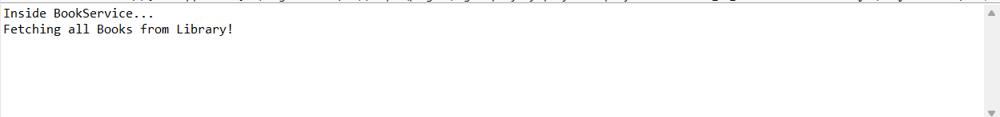
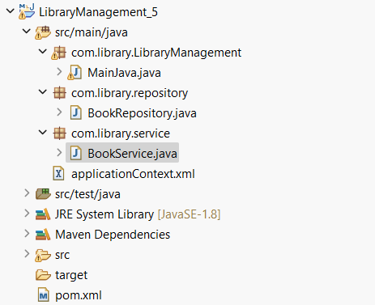

# Spring Core Maven 5

This project demonstrates the basics of Spring Core using Maven as the build tool. It is part of Week 3 assignments for Cognizant DN 4.0 Deep Skilling.

## Project Structure

```
week_3/Spring_Core_Maven_5/
│
├── src/
│   ├── main/
│   │   ├── java/
│   │   └── resources/
│   └── test/
├── outputs/
│   ├── output.png
│   └── program_structure.png
├── pom.xml
└── README.md
```

## How to Run

1. **Build the project using Maven:**
   ```
   mvn clean install
   ```

2. **Run the main class:**
   - Use your IDE to run the main Java class, or
   - Run from the terminal (replace `MainClass` with your actual main class name):
     ```
     mvn exec:java -Dexec.mainClass="com.package.MainClass"
     ```

## Output

After running the application, the output can be found in the `outputs` folder.

### Files in `outputs` folder

- [output.png](outputs/output.png)  
- [program_structure.png](outputs/program_structure.png)

#### Screenshots

- 
- 

*The images above show a sample run of the application and the overall program structure, displaying the results of Spring bean initialization and dependency injection as configured in the project.*

## Features Demonstrated

- Spring Bean configuration (via XML or annotations)
- Dependency Injection (Constructor/Setter)
- Maven project structure and dependency management

## Dependencies

- Java 8+
- Spring Core (as specified in `pom.xml`)
- Maven

## Author

- [loki-4445](https://github.com/loki-4445)

---
This is an educational example for Cognizant DN 4.0 Deep Skilling Week 3.
