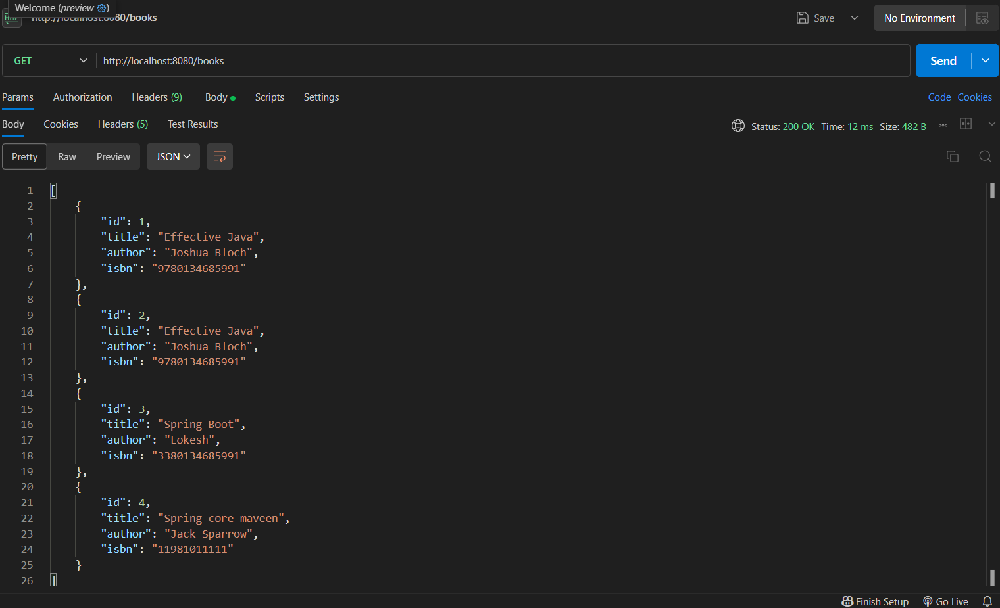
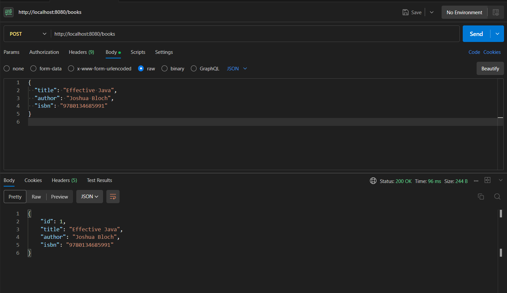
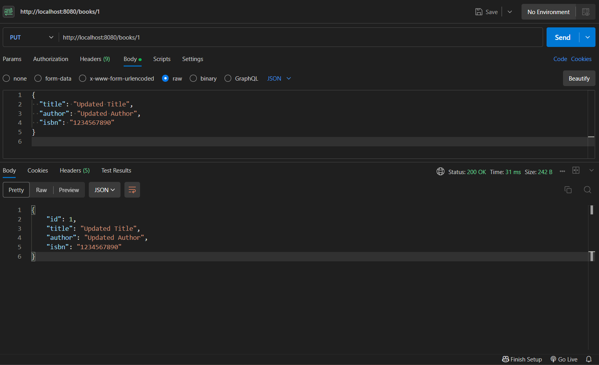
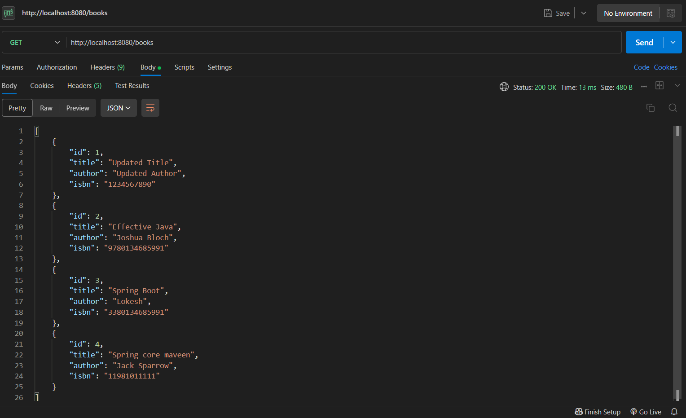
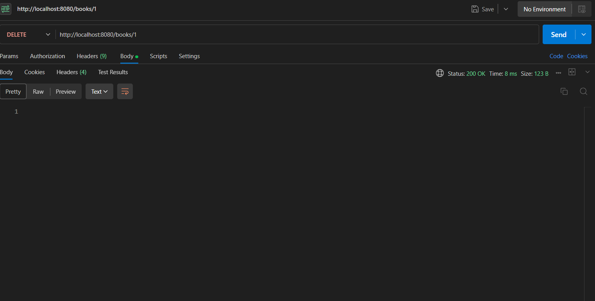
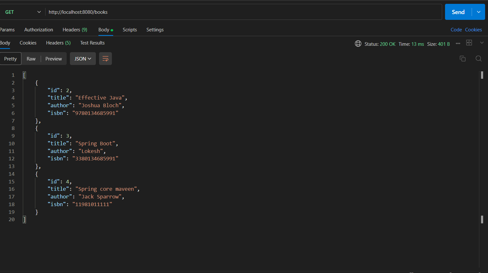

# Outputs Folder - Spring Core Maven Project

This folder contains various output files generated from running and experimenting with the Spring Core Maven project in `week_3/Spring_Core_Maven_9`.

## Project Description

The main project demonstrates fundamental concepts of the Spring Core Framework, such as Dependency Injection (DI), Inversion of Control (IoC), bean configuration, and using Maven for project management and builds.

## Program Structure

```
Spring_Core_Maven_9/
├── src/
│   └── main/
│       └── java/
├── resources/
├── outputs/
│   ├── README.mdaa
│   ├── output1.txt
│   ├── output2.txt
│   ├── error_log.txt
│   └── ...
├── pom.xml
```
---

## 🖼️ Output Images with Descriptions

---

## 🖼️ Output Images with Descriptions

### 🗂️ Program Structure
Shows the structure of the Spring Core Maven project.


---

### ✅ GET Method
Displays the output of a simple `GET` request to fetch data from the API.



---

### 📤 POST Method
Illustrates sending a `POST` request to insert or create new data.



---

### 🔁 PUT Method
Shows the result of using `PUT` to update an existing record.



---

### 📬 GET After PUT
Verifies the updated result with a `GET` request after performing a `PUT`.



---

### ❌ DELETE Method
Demonstrates a `DELETE` request to remove a record.



---

### 🔎 GET After Deleting
Displays the response of a `GET` request after deletion, usually showing empty or error response.



---

## 💡 Usage Instructions

1. **Run the project** with Maven (`mvn spring-boot:run`) or using your IDE.
2. **Use Postman or curl** to send HTTP requests to the defined endpoints.
3. **Refer these images** to validate that each method is functioning correctly.

> ✍️ Update this file whenever you add new outputs or update existing ones!

---

## 💡 Usage Instructions

1. **Run the project** with Maven (`mvn spring-boot:run`) or using your IDE.
2. **Use Postman or curl** to send HTTP requests to the defined endpoints.
3. **Refer these images** to validate that each method is functioning correctly.

> ✍️ Update this file whenever you add new outputs or update existing ones!
