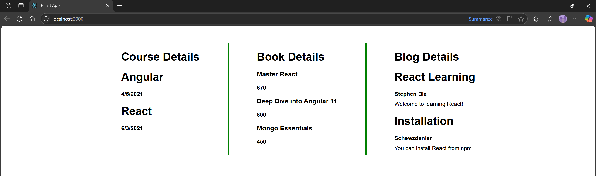

# Hands-on: 13. ReactJS HOL

## Scenario
Create a React App named “bloggerapp” in with 3 components.

1.	Book Details
2.	Blog Details
3.	Course Details

Implement this with as many ways possible of Conditional Rendering.

## Steps
### 1️⃣ Initial Setup
* Create a React project named “bloggerapp” by typing the following command in the terminal of Visual Studio:
```bash
npx create-react-app bloggerapp
```

### 2️⃣ Adding Data.js
* Create a file named `Data.js` inside the `src` directory.
* Press this to go to the file
  * [`Data.js`](./Code/bloggerapp/src/Data.js)

### 3️⃣ Adding CourseDetails Component
* Create a folder named `Components` inside the `src` directory.
* Inside the `Components` folder, create a file named `CourseDetails.js`.
* Press this to go to the file
  * [`CourseDetails.js`](./Code/bloggerapp/src/Components/CourseDetails.js)

### 4️⃣ Adding BookDetails Component
* Inside the `Components` folder, create a file named `BookDetails.js`.
* Press this to go to the file
  * [`BookDetails.js`](./Code/bloggerapp/src/Components/BookDetails.js)

### 5️⃣ Adding BlogDetails Component
* Inside the `Components` folder, create a file named `BlogDetails.js`.
* Press this to go to the file
  * [`BlogDetails.js`](./Code/bloggerapp/src/Components/BlogDetails.js)

### 6️⃣ Editing App.js
* Open the [`src/App.js`](./Code/bloggerapp/src/App.js) file and replace its content.

## Output


#### Explain various ways of conditional rendering
Conditional rendering in React can be achieved through several methods, each suitable for different scenarios. Here are some common ways:
1. **If-Else Statements**: Use standard JavaScript if-else statements to conditionally render components or elements based on a condition.
2. **Ternary Operator**: A concise way to render one of two components based on a condition.
3. **Logical AND Operator**: Render a component only if a condition is true.
4. **Switch Statement**: Useful for rendering different components based on multiple conditions.
5. **Short-Circuit Evaluation**: Similar to the logical AND operator, but can also be used with the logical OR operator to provide a default value.
6. **Inline Conditional Rendering**: Directly within JSX, you can use any of the above methods to conditionally render elements.
7. **Using State**: Manage state to control which component to render based on user interactions or other events.
8. **Higher-Order Components (HOCs)**: Create a higher-order component that wraps another component and conditionally renders it based on props or state.
9. **Render Props**: Use a function as a child to conditionally render components based on the function's return value.

####	Explain how to render multiple components
Rendering multiple components in React can be done in several ways, depending on the structure of your application and the data you are working with. Here are some common methods:
1. **Array Mapping**: Use the `map()` function to iterate over an array of data and return a component for each item.
2. **Conditional Rendering**: Use conditional statements to render different components based on certain conditions, allowing for dynamic rendering of multiple components.
3. **Component Composition**: Create a parent component that includes multiple child components, allowing you to render them together.
4. **Fragment**: Use React Fragments (`<></>`) to group multiple components without adding extra nodes to the DOM.
5. **Dynamic Imports**: Use React's lazy loading to import components dynamically, which can be useful for rendering multiple components conditionally based on user interaction or application state.

#### Define list component
A list component in React is a reusable component that renders a list of items, typically using an array of data. It can be implemented using the `map()` function to iterate over the array and return a list item for each element.

#### Explain about keys in React applications
In React, keys are unique identifiers assigned to elements in a list to help React identify which items have changed, been added, or removed. They are crucial for optimizing the rendering process and ensuring that the UI updates efficiently. Keys should be stable, predictable, and unique among siblings. Commonly, you can use an item's ID or index as a key, but using indices is discouraged if the list can change dynamically, as it can lead to performance issues and bugs in the UI.

#### Explain how to extract components with keys
To extract components with keys in React, you can create a separate component for the list items and pass the key as a prop. This approach enhances readability and reusability.

#### Explain React Map, map() function
The `map()` function in React is a JavaScript array method used to iterate over an array and transform its elements. In the context of React, it's commonly used to render lists of components by returning a new array of JSX elements. Each element in the array can be assigned a unique key prop to help React identify and manage the elements efficiently during re-renders.