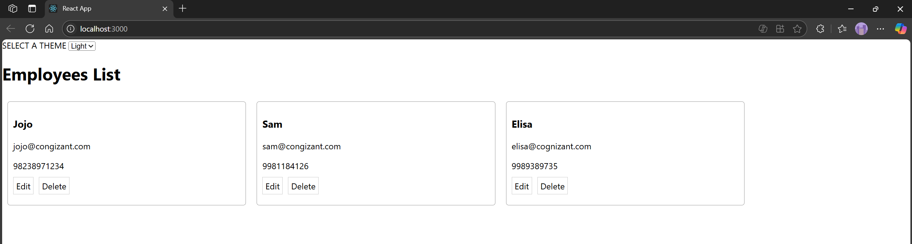
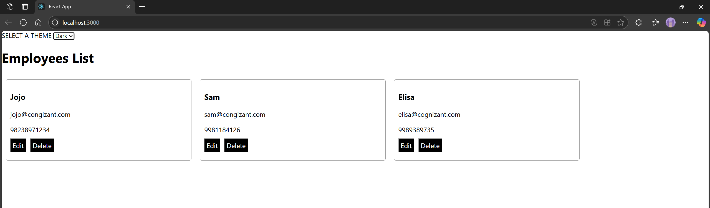

# Hands-on: 14. ReactJS HOL

## Scenario
1.	Explore the components present in App.js, EmployeesList.js and EmployeeCard.js files.
2.	Create a new file with the name as ThemeContext.js. Define a new context in the file with the name as ThemeContext and assign it a default value of ‘light’ and export it as default form the module.
3.	Open App component present in App.js file. 
    a.	Import the ThemeContext in App component. 
    b.	Define the theme context provider to be the entire JSX of the App component. 
    c.	Assign the value for the theme provider from the state of the component. 
    d.	Modify the call to EmployeeList component so that theme name is no longer passed as props.
4.	Go to EmployeeList component present in EmployeeList.js file and modify it so that theme name is not passed explicitly to its child component.
5.	Go to EmployeeCard component inside EmployeeCard.js file
    a.	Import the ThemeContext into the component file
    b.	Retrieve the value of the context with the help of useContext() and store it in a variable
    c.	Use the variable to pass the className for the buttons.

## Steps
### 1️⃣ Initial Setup
* Create a React project named “employeesapp” by typing the following command in the terminal of Visual Studio:
```bash
npx create-react-app employeesapp
```

### 2️⃣ Adding ThemeContext.js
* Create a file named `ThemeContext.js` inside the `src` directory.
* Press this to go to the file
  * [`ThemeContext.js`](./Code/employeesapp/src/ThemeContext.js)

### 3️⃣ Editing App.js
* Open the [`src/App.js`](./Code/employeesapp/src/App.js) file and replace its content.
* Press this to go to the file
  * [`App.js`](./Code/employeesapp/src/App.js)

### 4️⃣ Editing EmployeesList.js
* Open the [`src/EmployeesList.js`](./Code/employeesapp/src/EmployeesList.js) file and replace its content.
* Press this to go to the file
  * [`EmployeesList.js`](./Code/employeesapp/src/EmployeesList.js)

### 5️⃣ Editing EmployeeCard.js
* Open the [`src/EmployeeCard.js`](./Code/employeesapp/src/EmployeeCard.js) file and replace its content.
* Press this to go to the file
  * [`EmployeeCard.js`](./Code/employeesapp/src/EmployeeCard.js)

## Output
#### Light Theme

#### Dark Theme


#### Explain the need and Benefits of React Context API
The React Context API is a powerful feature that allows developers to share state and props across the component tree without having to pass them down manually through every level of the hierarchy. This is particularly useful in large applications where prop drilling (passing props through many layers of components) can become cumbersome and difficult to manage.

Benefits of using the React Context API include:

1. **Simplified State Management**: Context provides a way to manage global state in a more straightforward manner, reducing the need for complex state management solutions like Redux in many cases.

2. **Improved Code Readability**: By avoiding prop drilling, the code becomes cleaner and easier to understand, as components no longer need to be aware of the entire structure of the application.

3. **Enhanced Performance**: Context can help optimize performance by allowing components to subscribe only to the specific pieces of state they need, rather than re-rendering for every change in the parent component.

4. **Easier Testing**: With a centralized state management approach, testing components in isolation becomes simpler, as they can be provided with the necessary context without relying on the entire application structure.

Overall, the React Context API is a valuable tool for managing state and props in React applications, making it easier to build scalable and maintainable code.

#### Working with createContext()
The `createContext()` function in React is used to create a Context object, which allows you to share values (like state or functions) between components without having to pass props explicitly through every level of the component tree. Here's how it works:
1. **Creating a Context**: You create a context using `React.createContext()`. This function returns an object with two components: `Provider` and `Consumer`.

   ```javascript
   import React from 'react';

   const MyContext = React.createContext();
   ```
2. **Providing Context**: The `Provider` component is used to wrap the part of your application where you want the context to be available. You can pass a value to the `value` prop of the `Provider`, which will be accessible to all components within its subtree.

   ```javascript
    <MyContext.Provider value={{ someValue: 'Hello, World!' }}>
      <MyComponent />
    </MyContext.Provider>
    ```
3. **Consuming Context**: Components that need access to the context can use the `Consumer` component or the `useContext` hook (introduced in React 16.8). The `Consumer` component takes a function as a child, which receives the current context value.

```javascript
    <MyContext.Consumer>
      {({ someValue }) => <div>{someValue}</div>}
    </MyContext.Consumer>
```

4. **Using useContext Hook**: The `useContext` hook provides a more concise way to access context values in functional components. You simply call `useContext(MyContext)` to get the current context value.

   ```javascript
   import React, { useContext } from 'react';

   const MyComponent = () => {
     const contextValue = useContext(MyContext);
     return <div>{contextValue.someValue}</div>;
   };
   ```
#### List the types of Router Components
In React Router, there are several types of components that help manage routing in a React application. Here are the main types:
1. **BrowserRouter**: This component uses the HTML5 history API to keep your UI in sync with the URL. It is the most commonly used router for web applications.

   ```javascript
   import { BrowserRouter } from 'react-router-dom';
   ```  
2. **HashRouter**: This component uses the hash portion of the URL (the part after the `#`) to keep your UI in sync with the URL. It is useful for static file servers that do not support server-side routing.

   ```javascript
    import { HashRouter } from 'react-router-dom';
    ```
3. **MemoryRouter**: This router keeps the history of your navigation in memory (does not read or write to the address bar). It is useful for testing or non-browser environments.
    ```javascript
    import { MemoryRouter } from 'react-router-dom';
    ```
4. **Route**: This component is used to define a route in your application. It renders a specific component when the URL matches the specified path.
   ```javascript
   import { Route } from 'react-router-dom';
   ```
5. **Switch**: This component is used to group multiple `Route` components. It renders the first child `Route` that matches the current location, allowing for exclusive routing.
   ```javascript
    import { Switch } from 'react-router-dom';
    ```
6. **Link**: This component is used to create links that navigate to different routes in your application. It renders an anchor (`<a>`) tag with the specified `to` prop.
    ```javascript
    import { Link } from 'react-router-dom';
    ```
7. **NavLink**: Similar to `Link`, but it allows you to apply styles to the link when it is active (i.e., when the current route matches the link's `to` prop).
   ```javascript
   import { NavLink } from 'react-router-dom';
   ```
8. **Redirect**: This component is used to redirect the user from one route to another. It can be used to handle cases where a route is no longer valid or to redirect users after a successful action.
   ```javascript
    import { Redirect } from 'react-router-dom';
    ``` 
9. **Prompt**: This component is used to prompt the user before navigating away from a route, allowing you to prevent accidental navigation.
    ```javascript
    import { Prompt } from 'react-router-dom';
    ``` 

10. **Router**: This is a low-level interface for creating custom routers. It is not commonly used directly, but it can be useful for advanced routing scenarios.

    ```javascript   
    import { Router } from 'react-router-dom';
    ``` 


