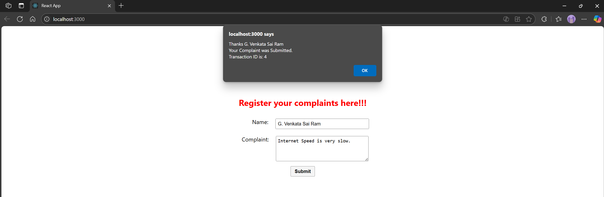

# Hands-on: 15. ReactJS HOL

## Scenario
Create a React App named “ticketraisingapp” which will help to raise a complaint and get it resolved. 

Create a component named “ComplaintRegister” with a form containing a textbox to enter the employee name and a textarea to enter the complaint. Use “handleSubmit” event of the button to submit the complaint and generate a Reference number for further follow ups in the alert box.

## Steps
### 1️⃣ Initial Setup
* Create a React project named “ticketraisingapp” by typing the following command in the terminal of Visual Studio:
```bash
npx create-react-app ticketraisingapp
```

### 2️⃣ Creating ComplaintRegister Component
* Create a new file named `ComplaintRegister.js` inside the `src` directory.
* Press this to go to the file
  * [`ComplaintRegister.js`](./Code/ticketraisingapp/src/ComplaintRegister.js)

### 3️⃣ Editing App.js
* Open the [`src/App.js`](./Code/ticketraisingapp/src/App.js) file and replace its content.
* Press this to go to the file
    * [`App.js`](./Code/ticketraisingapp/src/App.js)

### 4️⃣ Editing App.css
* Open the [`src/App.css`](./Code/ticketraisingapp/src/App.css) file and replace its content.
* Press this to go to the file
  * [`App.css`](./Code/ticketraisingapp/src/App.css)

## Output


####	Explain about React forms
React forms are a way to handle user input in a React application. They allow developers to create interactive and dynamic user interfaces where users can enter data, such as text, numbers, or selections. React provides controlled components, where form elements like input fields and text areas are bound to the component's state, allowing for real-time updates and validation.
This approach ensures that the form data is always in sync with the component's state, making it easier to manage and manipulate user input. React forms also support event handling, enabling developers to respond to user actions like submitting the form or changing input values. Overall, React forms enhance user experience by providing a seamless way to collect and process data within a React application.

#### Define controlled components
Controlled components in React are form elements whose values are controlled by the component's state. In a controlled component, the form data is handled by the React component rather than the DOM. This means that the value of the input field is set by the state of the component, and any changes to the input field trigger an update to that state.
This approach allows for better control over the form data, enabling features like validation, conditional rendering, and real-time updates. Controlled components typically use the `value` attribute to set the input's value and an `onChange` event handler to update the state when the user types or interacts with the input field. This ensures that the component's state is always in sync with the user input, making it easier to manage and manipulate form data within a React application.

#### Explain about various input controls
In React, various input controls are used to capture user input in forms. These controls include:
- Text Input: A single-line input field for text.
- Textarea: A multi-line input field for larger text blocks.
- Checkbox: A binary input for true/false values.
- Radio Button: A set of options where only one can be selected.
- Select Dropdown: A dropdown list for selecting one option from many.
- File Input: Allows users to upload files.
- Number Input: A field for numeric input, often with up/down controls.
These input controls can be managed as controlled components, where their values are tied to the component's state, allowing for real-time updates and validation. React provides built-in support for handling these input types, making it easy to create interactive forms that respond to user actions and maintain a consistent state throughout the application.

#### Explain about handling forms
Handling forms in React involves managing user input and form submission through controlled components. Here's a brief overview of how to handle forms in React:
1. **Controlled Components**: Use controlled components where the form elements' values are tied to the component's state. This allows for real-time updates and validation.
2. **State Management**: Maintain the form data in the component's state using `useState` or class component state. Update the state on user input using event handlers.
3. **Event Handling**: Implement event handlers for form events like `onChange` for input changes and `onSubmit` for form submission. These handlers will update the state or perform actions based on user interactions.
4. **Form Submission**: Handle form submission by preventing the default behavior (using `event.preventDefault()`) and processing the form data, such as sending it to a server or displaying a confirmation message.
5. **Validation**: Optionally, implement validation logic to ensure the input meets certain criteria before submission. This can include checking for required fields, valid formats, or custom rules.  
6. **Feedback**: Provide user feedback, such as success or error messages, based on the form submission outcome.

#### Explain about submitting forms
Submitting forms in React involves capturing the form data and processing it when the user submits the form. Here's a brief overview of how to submit forms in React:
1. **Form Element**: Wrap the form controls in a `<form>` element and use the `onSubmit` event to handle form submission.
2. **Prevent Default Behavior**: In the `onSubmit` event handler, call `event.preventDefault()` to prevent the default form submission behavior, which would cause a page reload.
3. **Access Form Data**: Access the form data from the component's state or by using refs to get the values of uncontrolled components.
4. **Process Form Data**: Process the form data as needed, such as sending it to a server via an API call or updating the application state.
5. **Reset Form**: Optionally, reset the form fields after successful submission to clear the input values.
6. **Feedback to User**: Provide feedback to the user, such as displaying a success message or redirecting them to another page after submission.